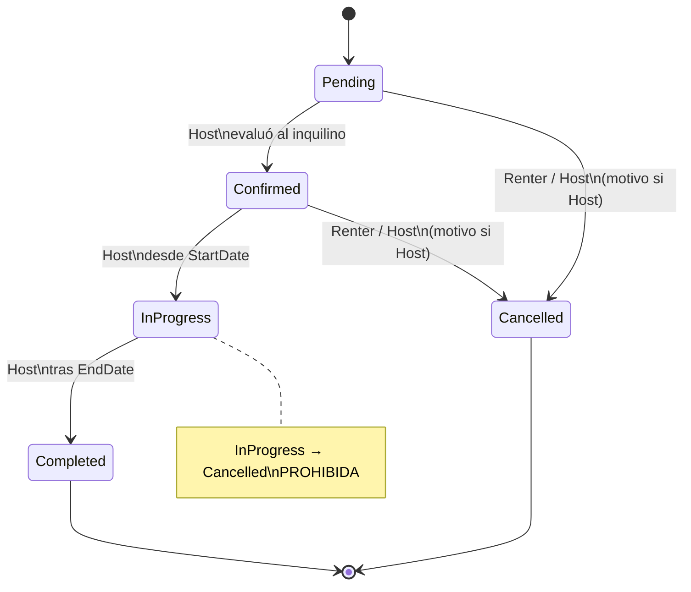

# Máquina de estados — Reserva (Wheelby)

Estructura declarada en la semana 4 (Práctica 1, sección 1.6). Las pruebas llegan en la semana 8.
Código: `src/backend/src/Domain/Wheelby/Wheelby.Domain/Reservations/`.

## Estados (RF-NEG-03)

Un único lugar: `ReservationStatus.cs`. Cinco estados, el máximo permitido.

| Estado | Significado |
|---|---|
| `Pending` | El inquilino solicitó la reserva; pendiente de evaluación del anfitrión. Estado inicial. |
| `Confirmed` | El anfitrión aceptó la reserva; el alquiler aún no comenzó. |
| `InProgress` | El alquiler está en curso. |
| `Completed` | El alquiler terminó. Terminal. |
| `Cancelled` | La reserva se canceló (incluye el rechazo del anfitrión, con motivo obligatorio). Terminal. |

El rechazo del anfitrión es una cancelación con motivo obligatorio, en lugar de un sexto estado.

## Actores

`ReservationActor.cs`: quién puede ejecutar cada transición.

| Actor | Quién es |
|---|---|
| `Renter` | El inquilino que solicita la reserva. |
| `Host` | El anfitrión, dueño del vehículo. Perfil de negocio de Wheelby, no un rol del Core. |

La máquina verifica el **tipo** de actor. Comprobar que un usuario concreto es el dueño del vehículo o el inquilino de esa reserva será trabajo de los casos de uso (no incluido aquí).

## Tabla de transiciones (RD-04)

Único lugar: `ReservationStateMachine.AllowedTransitions`. Idéntica al código. Agregar una transición es agregar una entrada; `Reservation.TransitionTo` es el único código que cambia `Status`.

| Desde | Hacia | Quién la ejecuta | Condición |
|---|---|---|---|
| `Pending` | `Confirmed` | `Host` | El anfitrión evaluó al inquilino (decisión humana, descriptiva). Guarda: `utcNow <= StartDate` (no confirmar algo ya vencido). |
| `Pending` | `Cancelled` | `Renter`, `Host` | Motivo obligatorio si cancela el anfitrión; solo antes del inicio (`utcNow < StartDate`). |
| `Confirmed` | `InProgress` | `Host` | El alquiler comienza; solo desde la fecha de inicio (`StartDate <= utcNow <= EndDate`). |
| `Confirmed` | `Cancelled` | `Renter`, `Host` | Motivo obligatorio si cancela el anfitrión; solo antes del inicio (`utcNow < StartDate`). |
| `InProgress` | `Completed` | `Host` | El alquiler terminó (`utcNow >= EndDate`). |

Las comprobaciones con la fecha de inicio son guardas de cada transición (`Func` en la misma tabla). Los métodos de dominio reciben `utcNow` por parámetro (RD-11). Las fechas se comparan en UTC; la zona horaria del usuario se tratará en la interfaz.

## Transición explícitamente prohibida (RF-NEG-04)

`ReservationStateMachine.ExplicitlyForbidden`:

| Desde | Hacia | Motivo |
|---|---|---|
| `InProgress` | `Cancelled` | Un alquiler en curso no se cancela; debe completarse. |

Cualquier otra combinación fuera de la tabla también se rechaza. Si la máquina rechaza, el estado no cambia.

## Estados terminales (RF-NEG-05)

`ReservationStateMachine.TerminalStates`: `Completed` y `Cancelled`. Ninguna transición parte de ellos.

## Rechazos

| Situación | Excepción | HTTP |
|---|---|---|
| Datos inválidos al crear (fechas no UTC, `StartDate >= EndDate`, inicio no futuro, `Guid` vacío) | `InvalidReservationDataException` | 400 |
| El actor no está en la lista de la transición, o no se cumple su condición (motivo, fechas) | `ReservationTransitionNotAllowedException` | 403 |
| Par (origen, destino) fuera de la tabla, transición prohibida explícita, u origen terminal | `InvalidReservationTransitionException` | 409 |

## Diagrama

## Notas de diseño

- **Un solo lugar (RD-04):** estados en `ReservationStatus`, tabla en `ReservationStateMachine.AllowedTransitions`. Buscar asignaciones a `Status` en `src/` solo encuentra la creación y `Reservation.TransitionTo`.
- **El Core no depende del negocio (RD-03):** ningún proyecto de `Core/` ni de `Shared/` referencia `Wheelby.*`; solo `Host.WebAPI` referencia `Wheelby.Infrastructure`. `VehicleId` y `RenterId` son `Guid` sin clave foránea hacia otros esquemas; la integridad entre módulos se garantizará en los casos de uso.
- **Persistencia:** esquema propio `wheelby`, tabla `Reservations` (`Status` guardado como texto), migración `InitialReservations` aplicada al arrancar por `Host.WebAPI`.
